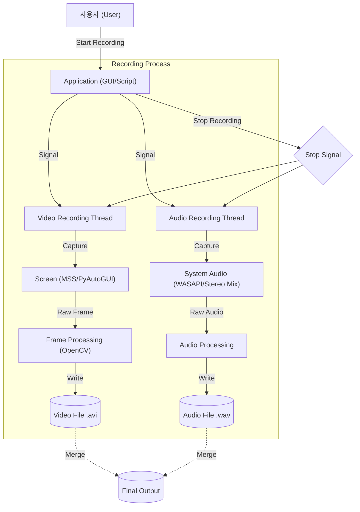

# VideoRecording Project

## 1. 프로젝트 개요 (Project Overview)
이 프로젝트는 Python을 사용하여 화면과 시스템 오디오를 녹화하는 도구 모음입니다. 단순한 화면 캡처부터 시스템 오디오(Stereo Mix, WASAPI Loopback)를 포함한 녹화, 그리고 GUI 기반의 녹화 애플리케이션까지 다양한 기능을 제공합니다.

### 주요 기능
- **화면 녹화**: `mss` (고성능) 또는 `pyautogui`를 사용하여 화면을 캡처하고 `OpenCV`로 저장합니다.
- **오디오 녹화**: `pyaudio` (Stereo Mix) 및 `sounddevice` (WASAPI Loopback)를 사용하여 시스템 소리를 녹음합니다.
- **GUI 지원**: `tkinter`를 이용한 사용자 친화적인 녹화 제어 인터페이스 (`recording2.py`)를 제공합니다.
- **동시 녹화**: 멀티스레딩 및 멀티프로세싱을 통해 화면과 오디오를 동시에 끊김 없이 녹화합니다.

## 2. 사용 기술 (Tech Stack)

이 프로젝트는 다음과 같은 기술과 라이브러리를 사용합니다:

| 분류 | 기술 / 라이브러리 | 설명 |
| :--- | :--- | :--- |
| **Language** | **Python 3.x** | 프로젝트의 주 언어 |
| **Video** | `OpenCV (cv2)` | 비디오 프레임 처리 및 저장 (XVID 코덱) |
| | `NumPy` | 이미지 데이터 배열 처리 |
| | `MSS` | 고성능 화면 캡처 (Video.py, VideoSound.py) |
| | `PyAutoGUI` | 스크린샷 캡처 (recording2.py) |
| **Audio** | `PyAudio` | 오디오 스트림 처리 (Stereo Mix) |
| | `SoundDevice` | WASAPI Loopback 시스템 오디오 캡처 |
| | `SoundFile` | 오디오 파일 저장 |
| **GUI** | `Tkinter` | 데스크톱 애플리케이션 UI |
| **Concurrency** | `Threading` | 비디오/오디오 동시 녹화 스레드 |
| | `Multiprocessing` | 프로세스 관리 |

## 3. 아키텍처 (Architecture)

이 프로젝트의 핵심 로직인 화면 및 오디오 동시 녹화의 구조는 다음과 같습니다.

### 파일 구조 설명
- **`Video.py`**: `mss`와 `cv2`를 이용한 기본적인 화면 녹화 스크립트입니다.
- **`sound.py`**: `sounddevice`를 이용한 시스템 오디오(WASAPI) 녹음 테스트 스크립트입니다.
- **`VideoSound.py`**: 화면과 시스템 오디오를 스레딩을 통해 동시에 녹화하는 스크립트입니다.
- **`recording2.py`**: `tkinter` GUI를 포함하며, `pyautogui`를 사용하는 완성형 녹화 애플리케이션입니다. `cache` 파일을 이용해 프로세스 간 통신을 수행합니다.
